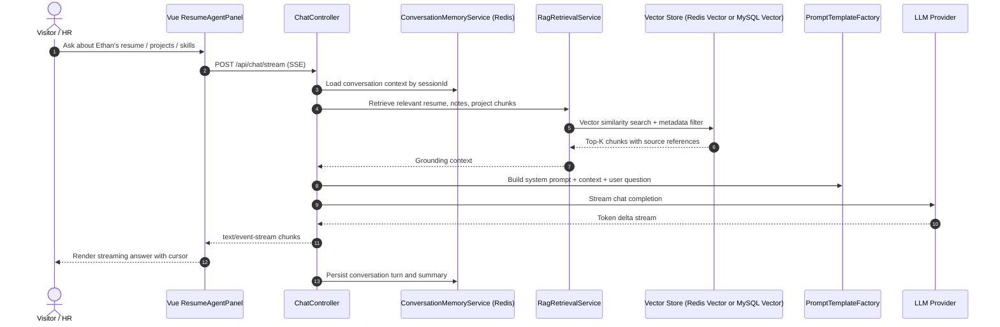
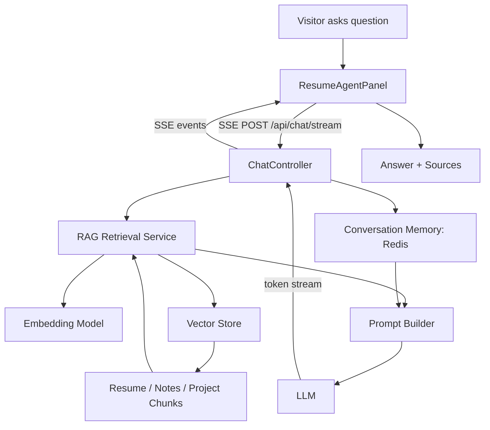

# Ethan's Portfolio Agent Guide

This repository is Ethan's personal portfolio project, branded as `weiqiang / 围墙`.
All future work should preserve the core idea: breaking technical barriers by showing depth in complex backend systems, high-concurrency architecture, and AI-enabled engineering.

## Product Direction

- Project name: `Ethan's Portfolio`
- Domain target: `weiqiang.me`
- Brand concept: `打破技术壁垒`
- Audience: recruiters, engineers, technical interviewers, and collaborators.
- Primary proof points:
  - Java backend engineering depth.
  - High-concurrency system design.
  - AI Agent, RAG, and model orchestration practice.
  - Ability to explain complex systems clearly through diagrams and interaction.

## Visual Direction

- Style: Minimalist Dark + Geek Terminal.
- Base colors: pure black, near-black panels, Dracula-inspired accent colors.
- Recommended palette:
  - `#000000` background.
  - `#0B0F14` panel.
  - `#F8F8F2` primary text.
  - `#8BE9FD` cyan accent.
  - `#50FA7B` green terminal accent.
  - `#FFB86C` warning/orange accent.
  - `#FF5555` critical accent.
- Avoid generic portfolio templates. Use sharp spacing, terminal-inspired motion, architecture diagrams, and strong typography hierarchy.
- Preserve classical whitespace: do not fill every area with cards or decorations.

## Recommended Repository Shape

The target architecture is a split frontend/backend workspace:

```text
Collection/
  AGENTS.md
  README.md
  docs/
    architecture.md
    api-contract.md
    brand-system.md
    rag-knowledge-plan.md
  web/
    package.json
    vite.config.js
    index.html
    public/
      favicon.svg
      og/
      diagrams/
    src/
      main.js
      App.vue
      style.css
      router/
        index.js
      assets/
        fonts/
        images/
      components/
        common/
          AppShell.vue
          SectionTitle.vue
          TerminalWindow.vue
          MermaidBlock.vue
        hero/
          HeroSection.vue
          TypewriterIntro.vue
        about/
          AboutSection.vue
          TechRadar.vue
          MethodologyTimeline.vue
        projects/
          ProjectsSection.vue
          ProjectCard.vue
          SkyTakeoutDiagram.vue
          DianpingDiagram.vue
        agent/
          ResumeAgentLauncher.vue
          ResumeAgentPanel.vue
          ChatMessage.vue
          StreamingCursor.vue
      composables/
        useTypewriter.js
        useChatStream.js
        useReducedMotion.js
      data/
        profile.js
        projects.js
        tech-stack.js
      services/
        apiClient.js
        chatClient.js
      styles/
        tokens.css
        typography.css
        animations.css
      views/
        HomeView.vue
        NotFoundView.vue
  api/
    pom.xml
    src/
      main/
        java/
          me/
            weiqiang/
              portfolio/
                PortfolioApiApplication.java
                common/
                  config/
                  exception/
                  response/
                profile/
                  ProfileController.java
                  ProfileService.java
                  dto/
                project/
                  ProjectController.java
                  ProjectService.java
                  dto/
                agent/
                  controller/
                    ChatController.java
                  service/
                    ResumeAgentService.java
                    RagRetrievalService.java
                    ConversationMemoryService.java
                  model/
                    ChatRequest.java
                    ChatResponse.java
                    SourceReference.java
                  prompt/
                    PromptTemplateFactory.java
                  ingestion/
                    DocumentIngestionService.java
                    ResumeParser.java
                    NoteParser.java
                infra/
                  ai/
                    LlmClientConfig.java
                    EmbeddingConfig.java
                  mysql/
                    MyBatisConfig.java
                  redis/
                    RedisConfig.java
                    RedisVectorStoreConfig.java
        resources/
          application.yml
          application-dev.yml
          application-prod.yml
          db/
            migration/
          prompts/
            resume-agent-system.md
          knowledge/
            resume/
            notes/
            projects/
      test/
        java/
          me/
            weiqiang/
              portfolio/
```

Current repository status: `web/` already exists as a Vue 3 + Vite project. Prefer evolving it rather than replacing it unless explicitly requested.

## Frontend Architecture

Use Vue 3 + Vite + Tailwind CSS for the first implementation. Keep the app SPA-friendly for Vercel deployment.

Core sections:

- Hero Section:
  - Terminal-style typewriter introduction.
  - Show `Ethan / weiqiang / 围墙`.
  - Communicate Java backend + AI Agent orientation immediately.
- About Me:
  - Technical stack radar chart.
  - Explain the `Why -> What -> How -> Deep Dive` learning methodology.
  - Avoid vague self-evaluation; prefer concrete engineering examples.
- Projects Showcase:
  - `苍穹外卖`: reserve Mermaid architecture diagram area.
  - `苍穹外卖` focus: state-machine concurrency safety, GLM intent recognition Agent, RAG-enhanced knowledge base flow.
  - `黑马点评`: reserve Mermaid flowchart area.
  - `黑马点评` focus: Caffeine + Redis two-level cache, Lua anti-oversell, high-concurrency path.
- Interactive Resume Agent:
  - Floating launcher at bottom-right.
  - Chat panel supports streaming output.
  - Show retrieved source snippets or source labels when available.
  - Gracefully degrade if API is unavailable.

Frontend implementation rules:

- Put remote calls under `src/services/`.
- Put reusable stateful logic under `src/composables/`.
- Keep presentational components small and section-specific.
- Do not hardcode API URLs directly inside components; use environment config.
- Prefer SSE for chat streaming.

## Backend Architecture

Use Spring Boot 3.x with Spring AI or LangChain4j. If the implementation starts from zero, prefer Spring AI first because it aligns naturally with Spring Boot configuration and dependency injection.

Backend responsibilities:

- Serve profile and project data.
- Provide chat endpoints for the Resume Agent.
- Parse resume, project notes, and technical notes into a local knowledge base.
- Chunk documents, generate embeddings, and store vectors.
- Retrieve relevant knowledge for user questions.
- Build grounded prompts with source references.
- Stream LLM output back to the frontend.
- Store conversation state in Redis.
- Store durable structured metadata in MySQL.

Suggested storage split:

- MySQL:
  - Profile metadata.
  - Project metadata.
  - Knowledge document metadata.
  - Optional chat analytics.
- Redis:
  - Short-term conversation memory.
  - Hot cache for profile/project APIs.
  - Vector retrieval if Redis Stack / Redis Vector is available.
- Local files:
  - Initial resume, notes, and project documents during early development.

## Interactive Resume Agent Data Flow



High-level component flow:



## API Contract

Use JSON for normal APIs and SSE for streaming chat. Prefix backend routes with `/api`.

### `POST /api/chat/stream`

Purpose: streaming interaction with the Resume Agent.

Protocol: `text/event-stream`.

Request:

```json
{
  "sessionId": "uuid-or-browser-generated-id",
  "message": "What did Ethan optimize in 黑马点评?",
  "locale": "zh-CN",
  "context": {
    "page": "projects",
    "projectId": "hm-dianping"
  }
}
```

SSE event types:

```text
event: delta
data: {"content":"..."}

event: sources
data: {"sources":[{"title":"黑马点评项目笔记","type":"project","score":0.87}]}

event: done
data: {"conversationId":"...","usage":{"inputTokens":0,"outputTokens":0}}

event: error
data: {"code":"RAG_RETRIEVAL_FAILED","message":"..."}
```

### `POST /api/chat`

Purpose: non-streaming fallback for environments where SSE is unavailable.

Response:

```json
{
  "answer": "Ethan used Caffeine + Redis as a two-level cache...",
  "sources": [
    {
      "title": "黑马点评项目笔记",
      "type": "project",
      "score": 0.87
    }
  ]
}
```

### `GET /api/profile`

Purpose: load About Me data, core identity, methodology, and contact links.

Response fields:

- `name`
- `brand`
- `headline`
- `summary`
- `methodology`
- `techStack`
- `contacts`

### `GET /api/projects`

Purpose: load project showcase cards and diagram metadata.

Response fields:

- `id`
- `name`
- `summary`
- `highlights`
- `techStack`
- `diagramType`
- `diagramSource`
- `links`

### `POST /api/knowledge/ingest`

Purpose: internal/admin endpoint to ingest resume and notes into the RAG knowledge base.

Keep this protected or disabled in production until authentication exists.

Request:

```json
{
  "source": "resume",
  "path": "classpath:knowledge/resume/ethan-resume.md",
  "rebuild": true
}
```

## Development Milestones

### Step 1: Foundation

- Normalize repository docs: `AGENTS.md`, `README.md`, `docs/architecture.md`.
- Confirm Vue 3 + Vite + Tailwind pipeline.
- Define design tokens for dark terminal style.
- Establish basic routes and section anchors.

### Step 2: Static Portfolio MVP

- Implement Hero terminal typewriter.
- Implement About section and methodology block.
- Implement Projects section with placeholder Mermaid diagrams.
- Add responsive layout and mobile navigation.
- Deploy the static frontend to Vercel preview.

### Step 3: Resume Agent UI

- Build floating `ResumeAgentLauncher`.
- Build chat panel with message list, input box, loading state, and streaming cursor.
- Implement frontend SSE client in `useChatStream.js`.
- Add local fallback mock responses for frontend-only development.

### Step 4: Spring Boot API Skeleton

- Create `api/` Spring Boot 3 application.
- Add CORS config for local Vite and Vercel preview domains.
- Implement `GET /api/profile` and `GET /api/projects`.
- Implement non-streaming `POST /api/chat` with a mock service.
- Add unified response and exception handling.

### Step 5: RAG Knowledge Pipeline

- Convert resume, project notes, and technical notes into Markdown knowledge files.
- Implement document chunking and metadata extraction.
- Generate embeddings.
- Store vectors in Redis Vector or the selected vector store.
- Implement top-K retrieval with source references.

### Step 6: Streaming Agent

- Implement `POST /api/chat/stream` with SSE.
- Connect retrieved context to LLM prompt generation.
- Add Redis-backed session memory.
- Return source references after retrieval.
- Add guardrails: answer only from Ethan-related knowledge when asked about Ethan.

### Step 7: Hardening and Observability

- Add request logging and latency metrics.
- Add rate limiting for chat endpoints.
- Add production environment variables.
- Add error states in the frontend.
- Add tests for API contracts, RAG retrieval, and chat service behavior.

### Step 8: Production Launch

- Deploy frontend to Vercel.
- Deploy API to the selected backend host.
- Configure `weiqiang.me`.
- Verify CORS, HTTPS, SSE streaming, and mobile UI.
- Run final content pass for project descriptions and diagrams.

## Engineering Rules for Future Agents

- Treat `AGENTS.md` as the primary project guide.
- Do not replace the current Vue project unless Ethan explicitly asks for a framework migration.
- Prefer incremental, working slices over large rewrites.
- Keep frontend and backend contracts documented when changing APIs.
- If implementing chat, build streaming first-class rather than as an afterthought.
- Keep RAG answers grounded: surface source references where possible.
- Do not commit secrets, API keys, resumes with private contact data, or production credentials.
- For frontend visual work, preserve the Minimalist Dark + Geek Terminal identity.
- For backend work, prefer clear package boundaries: controller, service, model/dto, config, infra.
- For diagrams, prefer Mermaid sources checked into the repo rather than screenshot-only assets.
