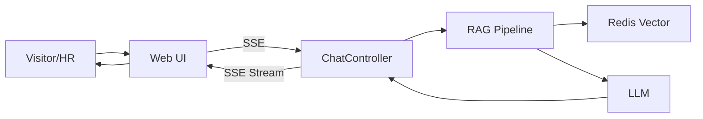

# CLAUDE.md

This file provides guidance to Claude Code (claude.ai/code) when working with code in this repository.

## Overview
- 当前仓库暂无代码与构建脚本。等工程初始化后，再补充常用命令与架构要点。

## Architecture (High-level)
- Web/UI：Vue 3 + Vite + Tailwind（Hero/About/Projects/Resume Agent）。
- API：Spring Boot 3 + Spring AI（Chat/RAG）。
- Data：MySQL（结构化内容）+ Redis Vector（向量与会话缓存）。

## RAG Data Flow

## API Sketch
- POST /api/chat/stream (SSE)
- POST /api/chat
- GET /api/profile
- GET /api/projects
