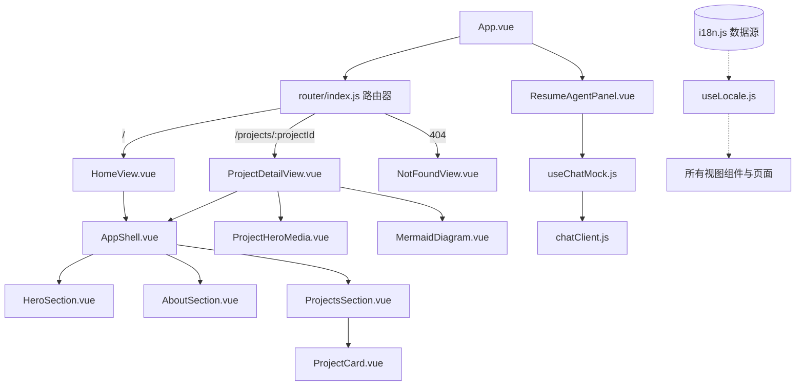

# 系统架构设计 (System Architecture)

## 1. 分层规则 (Layered Architecture Rules)
本作品集网站是一套纯前端（Frontend-only）应用，在开发环境中通过 Vite 构建，在生产中部署于 Vercel。其结构分为：
- **静态数据层 (`src/data/`)**：`i18n.js` 是全站的内容核心事实源，通过双语（zh-CN/en-US）隔离封装。
- **页面视图层 (`src/views/`)**：`HomeView.vue` 承载作品集主页内容；`ProjectDetailView.vue` 承载统一结构的动态项目详情视图（复用 `ProjectHeroMedia.vue` 与 `MermaidDiagram.vue`，并嵌套于 `AppShell.vue` 内）；`NotFoundView.vue` 作为路由未匹配时的回退容器。
- **业务服务层 (`src/services/`)**：`chatClient.js` 封装了 API 对话通信，`profileClient.js` 统一封装个人画像信息的同步导出。
- **组合式逻辑层 (`src/composables/`)**：封装多语言状态 `useLocale.js`、聊天流式模拟 `useChatMock.js` 和打字机渲染 `useTypewriter.js`。
- **交互组件层 (`src/components/`)**：细分 `hero`、`about`、`projects`、`agent` 和 `common` 模块。`ProjectsSection` 负责渲染首页三项目轻量预览网格；`ProjectCard` 统一展示标题、摘要、精简亮点、技术标签与跳转 CTA；`ProjectHeroMedia` 负责详情页 Hero 区的统一媒体壳层，可按数据驱动呈现视频预留态、截图型展示或静态产品证明；`MermaidDiagram` 承担架构图渲染及拖拽交互。

## 2. 架构图 (Architecture Diagrams)

